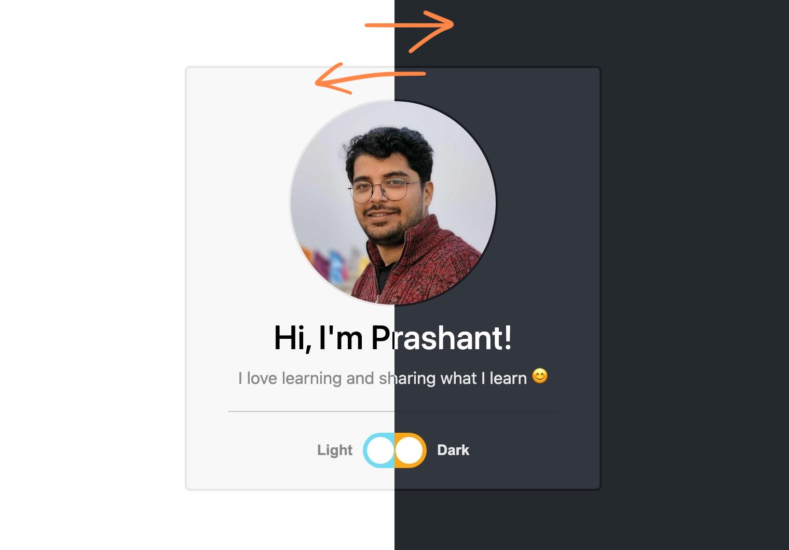

# light-dark-theme-django

> This project has some changes over the [light-dark-mode-django](https://github.com/divanov11/light-dark-mode-django) project by [divanov11](https://github.com/divanov11).

This is a simple Django-based project that allows users to toggle between **Light** and **Dark** themes on a website. The theme preference is stored both in the browser's localStorage and in the database to persist across sessions.



## Changes

The following key changes were made:

1. **Removed Unnecessary POST Requests on Page Refresh**:
   - In the previous version, a POST request was sent to the server on each page refresh. This has been removed, improving performance and reducing unnecessary server load.

2. **Replaced Two Buttons with a Single Toggle Switch**:
   - In the previous version, there were two separate buttons to toggle between the Light and Dark themes. Clicking the same button again (for the active theme) would unnecessarily send a theme change request to the server. This has been streamlined by replacing the two buttons with a single toggle switch that handles both Light and Dark modes efficiently.

3. **Implemented and Utilized `localStorage`**:
   - The previous project set `localStorage` but never actually used or fetched the theme preference from it. This version properly checks `localStorage` to apply the saved theme on page load, ensuring a persistent user experience across sessions.


## Features
- **Light/Dark Theme Toggle**: Users can switch between Light and Dark themes using a toggle button.
- **Persistent Theme Settings**: The selected theme is saved in the browser's localStorage and the database.
- **Django Rest API**: The theme preference is updated via a REST API endpoint.


## Installation

### Prerequisites
- Python 3.x
- Django
- Django Rest Framework

### Steps to Setup

1. Clone the repository:

   ```bash
   git clone https://github.com/vaidik1n1ly/light-dark-theme-django.git
   
2. Create a virtual environment inside project directory (recommended):

   ```bash
   cd light-dark-theme-django
   python -m venv venv
   source venv/bin/activate  # On Windows, use `venv\Scripts\activate`
   
3. Install the required dependencies:

   ```bash
   pip install -r requirements.txt

4. Run migrations to set up the database:

   ```bash
   python manage.py migrate

5. Create a superuser (optional, for admin access):

   ```bash
   python manage.py createsuperuser

6. Run the development server:

   ```bash
   python manage.py runserver

7. Visit the site in your browser at http://127.0.0.1:8000.


## Tech Stack
	•	Backend: Django, Django Rest Framework
	•	Frontend: HTML, CSS, JavaScript
	•	Database: SQLite (default, can be changed in settings)